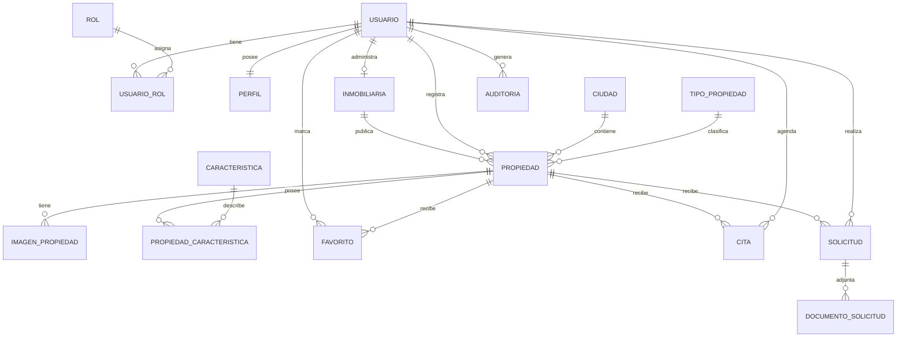

# 01. Modelo Entidad-Relación (MER)

> **Exportación visual:** `docs/01-MER.png` (versión final diagramada y exportada con Graphviz Online). El bloque Mermaid se conserva como representación textual de referencia.

## Entidades

El modelo físico definido en `database/ddl.sql` contiene 16 tablas principales:

1. `usuario`
2. `rol`
3. `usuario_rol`
4. `perfil`
5. `ciudad`
6. `tipo_propiedad`
7. `inmobiliaria`
8. `propiedad`
9. `imagen_propiedad`
10. `caracteristica`
11. `propiedad_caracteristica`
12. `favorito`
13. `cita`
14. `solicitud`
15. `documento_solicitud`
16. `auditoria`

Además existe la vista `v_propiedad_catalogo`, usada como apoyo para el catálogo público.

## Diagrama MER en Mermaid

## Relaciones principales

| Relación | Cardinalidad | Implementación |
|---|---|---|
| Usuario – Rol | N:M | `usuario_rol` |
| Usuario – Perfil | 1:1 | `perfil.id_usuario` UNIQUE |
| Usuario – Inmobiliaria | 1:0..1 | `inmobiliaria.id_usuario` UNIQUE |
| Inmobiliaria – Propiedad | 1:N | `propiedad.id_inmobiliaria` |
| Ciudad – Propiedad | 1:N | `propiedad.id_ciudad` |
| TipoPropiedad – Propiedad | 1:N | `propiedad.id_tipo_propiedad` |
| Propiedad – Imagen | 1:N | `imagen_propiedad.id_propiedad` |
| Propiedad – Característica | N:M | `propiedad_caracteristica` |
| Usuario – Propiedad favorita | N:M | `favorito` |
| Propiedad – Cita | 1:N | `cita.id_propiedad` |
| Usuario – Cita | 1:N | `cita.id_cliente` |
| Propiedad – Solicitud | 1:N | `solicitud.id_propiedad` |
| Usuario – Solicitud | 1:N | `solicitud.id_cliente` |
| Solicitud – Documento | 1:N | `documento_solicitud.id_solicitud` |
| Usuario – Auditoría | 1:N | `auditoria.id_usuario` |

## Reglas de negocio relevantes

- Una cuenta de usuario puede tener uno o más roles mediante `usuario_rol`.
- Una cuenta tiene como máximo un perfil debido a `UNIQUE(id_usuario)`.
- En este modelo una cuenta de agente administra como máximo una inmobiliaria debido a `UNIQUE(id_usuario)` en `inmobiliaria`.
- Una inmobiliaria puede publicar muchas propiedades.
- La relación propiedad-característica es N:M y `cantidad` es atributo de la relación.
- Un usuario no puede registrar dos veces la misma propiedad como favorita porque la PK de `favorito` es compuesta.
- Una propiedad no puede tener dos citas exactamente en la misma fecha y hora por la restricción `uq_cita_propiedad_horario`.
- Una solicitud puede tener varios documentos adjuntos.
